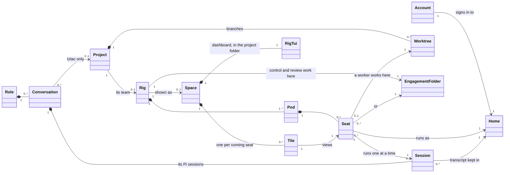

# How everything connects

A map of the AI setup on this machine, written for the person who uses it. Read the
first two sections and you can use the whole thing. The rest is reference.

## The model

Everything on this machine is one of these things. Each is owned by exactly one other
thing, or by nothing, and each has one tool that manages it.

| Thing | What it is | Where it lives |
| --- | --- | --- |
| **Account** | One subscription you have signed in to. There are four. | `~/.config/dev-platform/accounts.json` |
| **Home** | An account's own folder: login, settings, past transcripts. | `~/.claude`, `~/.codex`, or `accounts/<account>` |
| **Project** | One Git repository. | its checkout, usually `~/Dev/<project>` |
| **Worktree** | One branch of a project, checked out in its own folder. | `<checkout>/.claude/worktrees/` |
| **Session** | One conversation with one agent, in one folder, as one account. | a transcript inside that account's home |
| **Role** | Morty, Neo or Iztac: a persona and what it may touch. | `agents/<role>/identity.md` |
| **Conversation** | A role's durable thread, which spans many Pi sessions. | `sessions/conversations/<id>/` |
| **Rig**, or team | Agents working together on one project. | OpenRig's database, plus an engagement folder |
| **Pod** | A group of seats in a rig: control, review, workers. | the rig's spec |
| **Seat** | One agent slot: a runtime, a home, a folder and a tmux session. | tmux session `<pod>-<member>@<rig>` |
| **Space** | herdr's view of one rig. | herdr, labeled with the rig's name |
| **Tile** | A viewer of one seat, in the space's one tab beside `rig tui`. | a herdr pane |



The rules that follow from it:

- **A project owns its code.** Its checkout, its worktrees and its loop ledger. The only
  agent that writes inside it is a worker seat, in its own worktree, on its own branch.
- **A rig belongs to one project.** The menu names it `iztac-<project>`. Its control seat
  and overseer work from an engagement folder outside the repository, so the day branch
  stays clean. One running rig per project.
- **A seat belongs to one rig.** OpenRig enforces this: a seat is one tmux session with one
  owner. What crosses rigs is everything above a seat. Any seat in any rig can run as any
  account. The same role definitions serve every rig. A session's history outlives its seat.
- **A session is one conversation.** One runtime, one account, one folder. A plain Claude
  session you open in a project has no rig and no seat, and that is normal. A seat runs one
  session at a time and resumes it when relaunched.
- **A space is only a view.** It holds tiles, and a tile only watches a seat through tmux.
  Closing a tile or a whole space stops nothing. The menu keeps exactly one space per rig,
  with one tab: `rig tui` on the left, opened in the project folder, and a tile for every
  running agent beside it. Picking an agent in the menu zooms its tile in that space. It
  never opens a new one. A space that is missing an agent is rebuilt whole.
- **Accounts sit above everything.** They belong to no project or rig. `ai-usage` reads
  them all at once.

| Tool | Manages |
| --- | --- |
| `ai` | Everything. The menu, and the only command you need day to day. |
| `ai-work`, `dev-loop` | Projects, worktrees and the development loop. |
| `ai-session` | Sessions and conversations. |
| `ai-role` | Opening a role's conversation. |
| `ai-account`, `ai-environment`, `ai-login`, `ai-profile` | Accounts and homes. |
| `ai-usage` | How much each account has left. |
| `dev-workspace` | Starting rigs, and adding or removing worker seats. |
| `rig` | OpenRig itself: rigs, pods and seats. |
| `tmux` | The terminal each seat runs in. |
| `herdr` | Spaces and tiles. |

On disk:

```
~/Dev/<project>/                          a project's checkout
  .claude/worktrees/day-<date>/           the loop's day branch
  .claude/worktrees/loop-<N>-<slug>/      one issue's branch; its worker seat works here
~/.claude  ~/.codex                       the two default homes
~/.config/dev-platform/                   accounts.json, repos.conf, personal.conf
~/.local/share/dev-platform/
  accounts/<account>/                     the two isolated homes
  accounts/pi/<account>/                  Pi profiles
  current -> releases/<commit>/           the platform: bin, lib, agents, integrations
  openrig-runtime/                        OpenRig, pinned
~/.local/state/dev-platform/
  sessions/                               the session index and role conversations
  engagements/<project>/                  where a project's control seat and overseer work
  openrig/                                rig specs and worker fragments the launcher writes
  loop/<owner__repo>/                     the loop ledger
  usage/                                  Claude usage readings
~/.openrig/                               OpenRig's daemon database
~/.config/herdr/                          herdr's server socket and saved layout
```

## How an agent is told what to do

An agent's instructions come from layers. Each layer is a file or a message, and each has
one owner.

| Layer | Where it comes from | Reaches |
| --- | --- | --- |
| Account instructions | `CLAUDE.md` or `AGENTS.md` in the account's home. `ai-profile` copies the default home's file into the isolated homes. | Every session and seat running as that account |
| Project instructions | The repository's own `AGENTS.md` or `CLAUDE.md` | Anything working in that checkout or one of its worktrees |
| Seat guidance | The agent definition a seat uses (`integrations/openrig/agents/<agent>/guidance/role.md`). OpenRig merges it into the seat folder's `CLAUDE.md` or `AGENTS.md` as a managed block. | That seat only |
| OpenRig culture | OpenRig's default culture file, merged the same way | Every seat |
| Identity message | OpenRig types a short "which seat you are" message once the agent is ready | Every seat, at start |
| A task | A worker's `.worker-brief.md`, written by the loop into its worktree | That worker, when told to start |
| Role resources | For Morty, Neo and Iztac: shared session entry, the role's identity, its memory, and for Iztac the project's own instructions and the Iztac engineering skill | That role's Pi sessions |

A rig spec can set seat instructions at three levels, the whole rig, one pod or one seat,
and they add up. Each level can carry files and actions:

- **A file with `delivery_hint: guidance_merge`** becomes standing instructions, like the seat guidance above.
- **A file with `delivery_hint: skill_install`** installs a skill into that seat's folder.
- **A file or action with `send_text`** is a prompt typed into the agent after it starts. That is how OpenRig's own templates brief their agents, and why they start working on their own.
- **A `slash_command` action** runs one of the agent's commands at start.

Who may talk to whom is declared separately, as **edges** between seats, inside a pod or
across pods. Seats talk through `rig send` and OpenRig's queue.

The platform's three agents use none of the prompt options. Control, overseer and worker each
get standing guidance only, and they wait for you. Their rigs declare no edges. The only
message typed into them automatically is OpenRig's identity message.

## Skills: where they live and who sees them

A skill is a folder with a `SKILL.md`. An agent sees a skill only if it sits in the skills
folder of the home it runs as: `<home>/skills`, for Claude and Codex alike.
`~/.agents/skills` is the shared folder the default homes link through.

| Where skills come from | What |
| --- | --- |
| The platform release, `skills/` | `bounded-decisions`, `deploy-verify`, `development-workspace`, `distill`, `intake`, `loop`, `new-repo`, `session-entry`, `spec-lint`, `staging-census` |
| Iztac's own resources | `iztac-engineering`, loaded only into Iztac's Pi sessions |
| OpenRig | `openrig-skills`, vendored into the default Claude home and the shared folder |
| The clients themselves | Claude desktop's synced skills; Codex's own |

| Runs as | Platform skills it sees |
| --- | --- |
| `anthropic-gmail` (`~/.claude`) | All ten |
| `openai-apple` (`~/.codex`) | All ten |
| `anthropic-apple` (isolated) | None. Only Claude desktop's synced skills. |
| `openai-gmail` (isolated) | None |
| An OpenRig seat | Whatever its account's home has, plus any `skill_install` in its agent. The platform's agents install none. |
| Morty, Neo, Iztac (Pi) | Skill discovery is off. Session entry arrives as instructions; Iztac also gets its engineering skill. |

Two consequences. A seat or session on an isolated account does not have `loop`,
`development-workspace` or the others as skills; session entry still reaches it, because its
instructions point at the default home's copy. And the links are not uniform: some point at
an older release folder and some at the development checkout, so the version an agent reads
depends on the link, not on what is installed.

## Every tool, and how they connect

Each tool owns one thing. The table shows what it reads and what it hands work to.

| Tool | Owns | Reads | Calls |
| --- | --- | --- | --- |
| `ai` | Nothing; the front door | projects, sessions, conversations, usage, rigs, herdr | every command below |
| `ai-account` | Which account is selected; account bindings | `accounts.json`, native login status | `claude`, `codex` |
| `ai-environment` | Launch plans: may this account run now? | bindings, live quota | `ai-account run` |
| `ai-login` | Guided native sign-in | bindings | `claude`, `codex`, `pi` |
| `ai-profile` | Equipping isolated homes: hooks, instructions, rules, status line | the default homes, `hooks/` | nothing |
| `ai-usage` | The usage readout | Codex live, Claude status-line caches, OpenRig seat caches | nothing |
| `ai-env doctor` | The setup check | commands, skill links, Laya, tmux | nothing |
| `ai-work` | The project catalog | `repos.conf`, `~/Dev`, the session index | the loop |
| `dev-loop` | Day branches, worker worktrees, the ledger, fold and close | GitHub issues through `ghx` | workers, or `dev-workspace add-worker` for seats |
| `ai-session` | The session index and role conversations | native transcripts in every home | `claude --resume`, `codex resume` |
| `ai-role` | Launching Morty, Neo and Iztac | conversations, Pi profiles, role identities | Pi |
| `ai-memory`, `ai-history`, `journal`, `harvest` | Role memory, preserved history, the journal, time tracking | their own stores | nothing |
| `dev-workspace` | Starting rigs, seating and unseating workers | account plans, the loop's worktrees | `ai-environment`, `rig` |
| `rig` | OpenRig: rigs, pods, seats, snapshots, queue | its database in `~/.openrig` | `tmux`, `herdr`, `claude`, `codex` |
| `tmux` | The terminal each seat runs in | nothing | the agent |
| `herdr` | Spaces and tiles | nothing | `tmux attach` in each tile |
| `hooks/` | The guard before tool use, the check at stop, formatting | the command about to run | `check-once` |
| `check`, `new-repo` | The platform's tests; new repositories from templates | `templates/` | `git`, `gh` |
| `claude`, `codex`, `pi` | The agents themselves | their home, their folder | tools, through their own permission and sandbox rules |

## What OpenRig writes into your project folder, and why

When a seat starts in a folder, OpenRig places three small files there:

- `.claude/settings.local.json`: tells Claude to run OpenRig's status line, so the daemon
  can watch context usage.
- `.openrig/context-collector.cjs`: that status line script.
- `CLAUDE.md` for Claude, `AGENTS.md` for Codex: guidance blocks added to the file, or the
  file created if it is missing. They tell the agent which seat it is and how to behave.

This is OpenRig treating the folder as the seat's workspace. It is harmless in a scratch
folder or one of your own projects. It is the reason the launcher refuses to start a seat
directly inside a professional repository checkout: those files would show up in someone
else's git status.

For project work the rule is one seat per working branch. The control seat and the Codex
overseer run from an engagement folder outside the repository. Each worker seat runs in the
worktree the loop cut for its issue, and is removed before its branch is folded, which puts
the guidance files back. `docs/rig-working-branches.md` has the commands.

## Day to day

**Start with the menu.** One command covers everything below: projects, sessions, Morty,
Neo, Iztac, teams and accounts. Arrow keys move, typing filters, Enter opens, Esc goes back,
Ctrl+C quits. Anything you open hands over the terminal and comes back to the menu when you
leave it.

```bash
ai
```

`ai research` jumps straight to the project whose name matches. The commands below are
what the menu runs for you.

**See how much you have left.** Nothing changes.

```bash
ai-usage
```

Codex numbers are live. Claude numbers are a recent reading with an age, because Anthropic
exposes usage only inside a running session; a status line captures it as it renders.
An account that has not been used since the collector was installed reads as unknown, which
is the truth, never zero.

**Open the dashboard.** Nothing changes. Press `?` inside it for every command.

```bash
dev-workspace
```

**Start one seat on a chosen account.** Always plan first; it refuses an account that is
out of quota or not verified, and it launches nothing.

```bash
dev-workspace plan claude --account anthropic-apple --cwd /path/to/folder
dev-workspace start claude --account anthropic-apple --cwd /path/to/folder
```

Each account gets its own rig name, so two accounts never collide. Reusing a rig resumes
its original session in its original folder.

**Start a team from a template.** List the templates, preview one, and launch it:

```bash
rig specs ls
rig specs preview conveyor
rig up conveyor --cwd /path/to/folder
```

To put each seat of a team on a different account, copy the template's `rig.yaml`, add
`config_home: <that account's home>` under the seats you want pinned, change `local:`
agent references to `path:/absolute/...`, and `rig up` your copy. A seat without
`config_home` uses the machine default for its runtime.

Templates deliver their role briefs by typing text into each agent on startup. If you want
silent seats, point the members at the platform's own agent, which sends nothing:
`path:~/.local/share/dev-platform/current/integrations/openrig/agents/control`.

**Attach to a seat, detach, stop a team.**

```bash
tmux attach -t <seat-name>        # Ctrl-b then d to detach
rig down <rig-name>               # stops every seat, keeps a snapshot
```

**Give Morty, Neo and Iztac web search.** Their search tool uses Perplexity, and its key
lives in your login Keychain. Add it once; the command asks for the key without showing it:

```bash
security add-generic-password -s dev-platform-perplexity -a "$USER" -w
```

The role launcher reads it at each launch and passes it only to that Pi process. The launch
line ends with `search on` or says why it is off. Claude and Codex sessions use their own
built-in web search, not Perplexity.

The roles also have `web_fetch`, which reads one public page by its address. It needs no
key and costs nothing, so they use it whenever they already know the page, and Perplexity
only to find pages. It refuses local and private network addresses at every redirect, so a
page cannot point it at services on this machine.

## What was changed on this machine, and how to undo each

- **OpenRig is a local fork.** Build `0.5.14 (113182b7)` opens herdr views inside the rig's
  own space, and adds the per-seat `config_home`
  field. Stock 0.5.14 is parked beside it. Undo: swap the two `app` directories and restart
  the daemon. Provenance and the upstream contribution notes are in the migration workspace.
- **The daemon runs outside OpenClaw.** It used to inherit OpenClaw's environment, including
  a proxy URL that no longer exists. It now starts from a clean environment. Undo: nothing to
  undo; starting it from an OpenClaw shell would reintroduce the problem.
- **The tmux server was scrubbed.** Its global environment carried that same dead proxy, so
  every new seat inherited it. The launcher now removes such variables before every start,
  and `ai-env doctor` reports them.
- **The two isolated homes were equipped.** Guard hooks, global instructions, the usage
  status line, and the answer to Claude's first-run Chrome dialog. `ai-profile plan <account>`
  shows what a home is missing; `ai-profile apply <account>` fixes it, idempotently, never
  touching a credential.
- **A platform release was cut and activated.** `current` points at it. Undo: point `current`
  back at the previous release directory.

## Known limits

- **Open a team from the menu once before using `rig tui` to open agents.** The patched
  OpenRig opens agents inside a space named for their rig, and the menu is what builds that
  space. Before it exists, OpenRig falls back to making a new space for each open.
- **Ending an agent from inside its tile leaves a bare shell in its seat.** The menu shows
  that seat as stopped and relaunches it on request. Leave a tile with Ctrl+b then q instead.

- **Claude usage is a snapshot.** No command can ask Anthropic for it; only a running session
  reports it. Expect an age on every Claude number.
- **The dashboard shows Codex seats as "needs attention".** OpenRig judges a seat by the
  terminal's foreground process, and on this machine `codex` is a Node wrapper, so the check
  reads the wrapper instead of the real binary. Claude seats verify correctly. Reported upstream.
- **A stopped rig cannot be restored with `rig up --existing`.** The harness never relaunches.
  This is stock OpenRig behavior, reproduced with and without account pinning. Start a fresh
  rig instead.
- **A seat launch can drop the usage status line from its account home.** Rerun
  `ai-profile apply <account>` afterward if the Claude number for that account stops updating.

## When something looks wrong

| Symptom | Cause | Fix |
| --- | --- | --- |
| Daemon dies at start with `ERR_DLOPEN_FAILED` | Wrong Node on PATH | Start it through `dev-workspace` or `bin/rig`, which use the pinned Node 24 |
| A new seat sits on "Connection refused, retrying" | Inherited dead proxy URL | `ai-env doctor` shows it; `dev-workspace start` removes it; or `tmux set-environment -g -u ANTHROPIC_BASE_URL` |
| A seat times out after 30 seconds, never interactive | Claude's first-run Chrome dialog in a fresh home | `ai-profile apply <account>` records the answer |
| `ai-account status` says every account is unverified | Run from inside a Claude desktop session, which sets a provider variable | Run it from a plain terminal |
| A Codex seat shows "needs attention" but works | The foreground-process check, see Known limits | Ignore, or report upstream |
